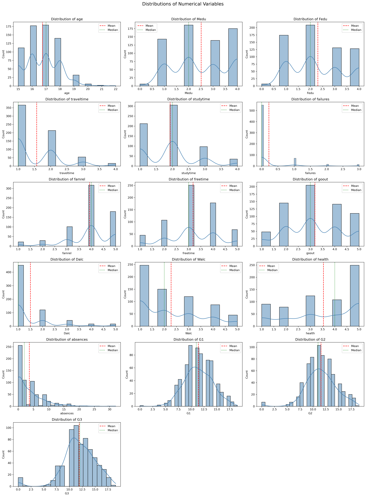
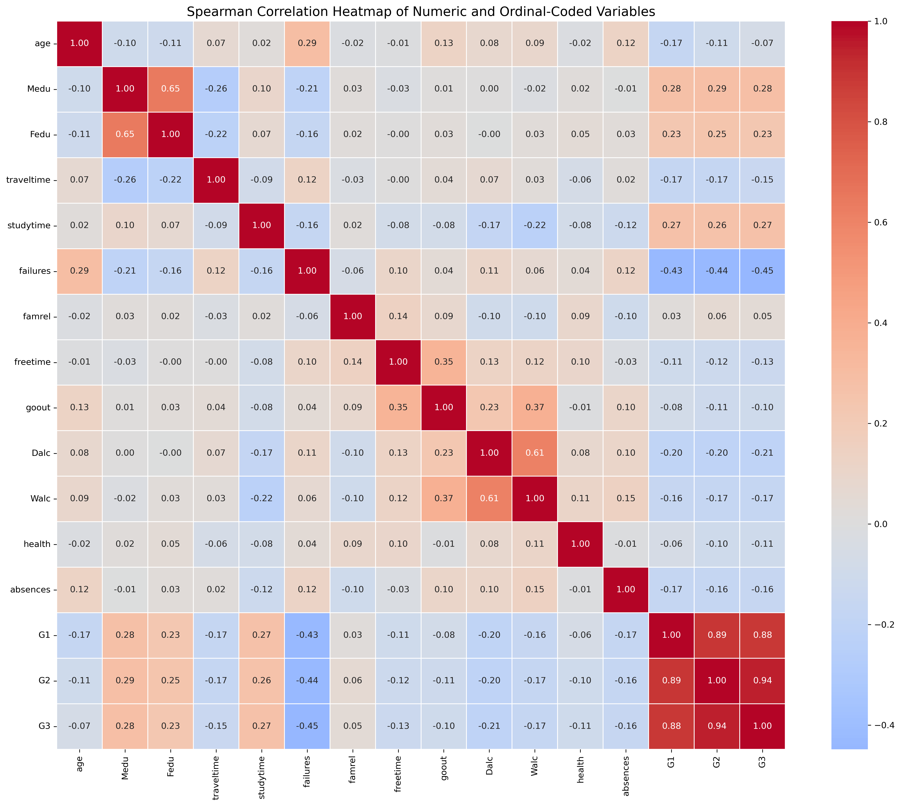
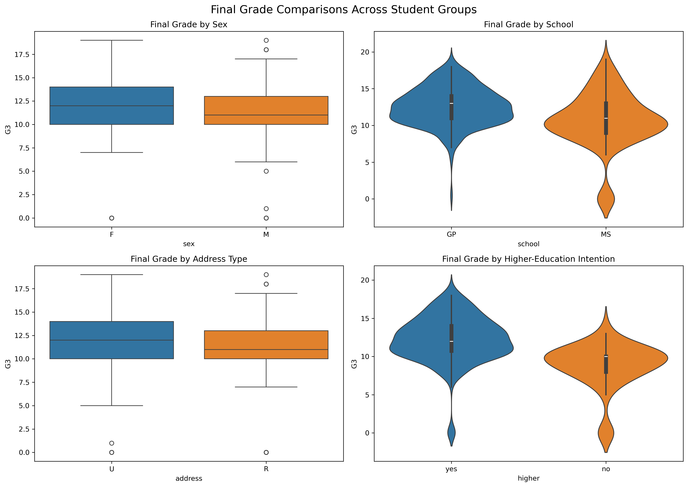
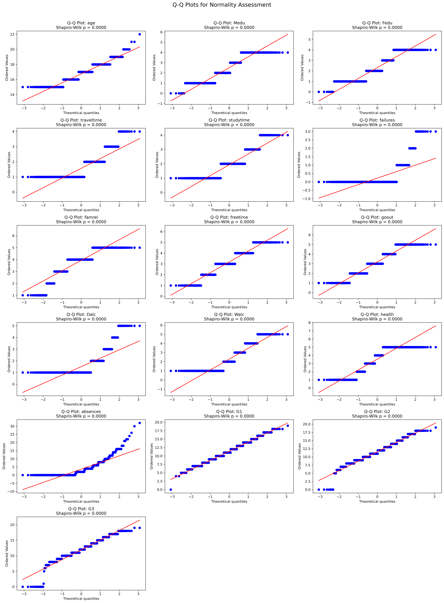

# Week 1 Progress Report: Data Preparation, Statistical Analysis, and Visualization

## Team: Statistics Superstars
**Date:**  8 Sept 2026

## 1. Dataset Overview
### Selected Dataset: UCI Student Performance Dataset

**Source:** [UCI Machine Learning Repository](https://archive.ics.uci.edu/dataset/320/student+performance)

**Description:**
This dataset contains academic, demographic, social, and family-related information about students from two Portuguese secondary schools. The Portuguese-language course dataset (`student-por.csv`) is used as the primary dataset. The Mathematics course dataset (`student-mat.csv`) is retained as supplementary data.

**Shape:** 649 rows × 33 columns

**Variables:**

| Variable | Type | Description | Missing (%) |
|----------|------|-------------|-------------|
| school | categorical | Student’s school (GP or MS) | 0% |
| sex | categorical | Student’s sex (F or M) | 0% |
| age | numeric | Student’s age | 0% |
| address| categorical | Urban or rural home address | 0% |
| famsize | categorical | Family size category | 0% |
| Pstatus | categorical | Parents living together or apart | 0% |
| Medu | ordinal | Mother’s education level (0–4) | 0% |
| Fedu | ordinal | Father’s education level (0–4) | 0% |
| Mjob | categorical | Mother’s occupation | 0% |
| Fjob | categorical | Father’s occupation | 0% |
| reason | categorical | Reason for choosing the school | 0% |
| guardian | categorical | Student’s guardian | 0% |
| traveltime | ordinal | Home-to-school travel-time level (1–4) | 0% |
| studytime | ordinal | Weekly study-time level (1–4) | 0% |
| failures | numeric | Number of previous class failures | 0% |
| schoolsup | categorical | Extra educational support | 0% |
| famsup | categorical | Family educational support | 0% |
| paid | categorical | Extra paid classes | 0% |
| activities | categorical | Participation in extracurricular activities | 0% |
| nursery | categorical | Attended nursery school | 0% |
| higher | categorical | Intention to pursue higher education | 0% |
| internet | categorical | Internet access at home | 0% |
| romantic | categorical | Currently in a romantic relationship | 0% |
| famrel | ordinal | Quality of family relationships (1–5) | 0% |
| freetime | ordinal | Free-time level after school (1–5) | 0% |
| goout | ordinal | Frequency of going out with friends (1–5) | 0% |
| Dalc | ordinal | Workday alcohol consumption (1–5) | 0% |
| Walc | ordinal | Weekend alcohol consumption (1–5) | 0% |
| health | ordinal | Current health status (1–5) | 0% |
| absences | numeric | Number of school absences | 0% |
| G1 | numeric | First-period grade (0–20) | 0% |
| G2 | numeric | Second-period grade (0–20) | 0% |
| G3 | numeric | Final grade (0–20) | 0% |

A more detailed explanation of all variables and their valid values is available in [`reports/data_dictionary.csv`](data_dictionary.csv).

## 2. Data Cleaning Summary

### Steps Performed:

1. **Missing Values:** No missing values were detected, so no imputation was required.

2. **Duplicates:** No completely duplicated rows were found or removed.

3. **Data Types:** Numeric and categorical columns were checked and already had appropriate data types.

4. **Outliers:** The IQR method flagged 21 records with unusually high absence values. These records were retained because they were valid observations. No outliers were removed or capped.

5. **Derived Columns:** No derived columns were added during cleaning.

6. **Validation:** All numeric and categorical values passed the documented range and category checks.

**Original Shape:** 649 rows × 33 columns
**Cleaned Shape:** 649 rows × 33 columns

The cleaned dataset is identical to the standardized raw dataset because no invalid observations were found.

**See:** [`reports/cleaning_log.txt`](cleaning_log.txt) for detailed cleaning actions.

## 3. Statistical Findings

### Key Summary Statistics:
| Variable | Mean | Median | Std | Skew | Kurtosis |
|----------|------|--------|-----|------|----------|
| Age | 16.74 | 17.00 | 1.22 | 0.42 | 0.07 |
| Absences | 3.66 | 2.00 | 4.64 | 2.02 | 5.78 |
| G1 | 11.40 | 11.00 | 2.75 | -0.00 | 0.04 |
| G2 | 11.57 | 11.00 | 2.91 | -0.36 | 1.66 |
| G3 | 11.91 | 12.00 | 3.23 | -0.91 | 2.71 |

### Normality Tests:
| Variable | Shapiro-Wilk p-value | Normal? |
|----------|----------------------|---------|
| Age | 1.52 × 10⁻¹⁸ | ❌ No |
| Absences | 4.52 × 10⁻²⁹ | ❌ No |
| G1 | 4.93 × 10⁻⁶ | ❌ No |
| G2 | 5.58 × 10⁻¹² | ❌ No |
| G3 | 2.42 × 10⁻¹⁷ | ❌ No |

### Strongest Correlations:
1. `G2` ↔ `G3`: **0.944** — Strong positive
2. `G1` ↔ `G2`: **0.893** — Strong positive
3. `G1` ↔ `G3`: **0.883** — Strong positive
4. `Medu` ↔ `Fedu`: **0.647** — positive
5. `Dalc` ↔ `Walc`: **0.613** — positive
6. `failures` ↔ `G3`: **-0.448** — negative

## 4. Key Visualizations

### Figure 1: Distribution Plots

### Figure 2: Spearman Correlation Heatmap

### Figure 3: Final-Grade Group Comparisons

### Figure 4: Q-Q Plots

## 5. Initial Insights

1. **Previous Grades Are the Strongest Indicators:** `G2` had the strongest relationship with the final grade (`G3`), with a Spearman correlation of 0.944. `G1` was also strongly related to `G3` at 0.883.

2. **Absences Had a Weaker Relationship Than Expected:** Absences had only a weak negative correlation with final grade (`ρ = -0.159`), while previous failures showed a stronger negative relationship (`ρ = -0.448`).

3. **Potential Analysis for Next Week:** The team will test whether final grades differ significantly by school, higher-education intention, study time, and previous failures. Because the data are non-normal, suitable non-parametric tests and effect sizes will be considered.

## 6. Data Quality Issues

### Problems Identified:

- No missing values, duplicate rows, invalid categories, or out-of-range values were detected.

- The `absences` variable is strongly right-skewed, and 21 records were flagged by the IQR method. These observations appear valid and were retained.

- Fifteen students have a final grade (`G3`) of zero. These are valid recorded values, but they influence the grade distribution and normality results.

- Several variables, including `studytime`, `health`, and alcohol consumption, are ordinal codes rather than continuous measurements.

- Some comparison groups are unbalanced. For example, 580 students intend to pursue higher education, compared with only 69 who do not.

- The data come from only two Portuguese schools, so the findings may not represent students in other schools or countries.

- The Portuguese and Mathematics datasets contain 382 overlapping students and must not be combined as if every row represents a different person.

### Recommendations:

- Retain valid outliers instead of automatically removing or capping them.

- Use medians, IQRs, Spearman correlations, and suitable non-parametric tests when normality assumptions are not satisfied.

- Report group sizes and effect sizes alongside p-values, especially for unbalanced categories.

- Conduct sensitivity analysis to determine whether zero final grades or unusually high absence values substantially change the results.

- Analyse the Portuguese dataset as the primary dataset. If the Mathematics dataset is used, analyse it separately or carefully account for overlapping students.

- No additional external dataset is currently required for Week 2 analysis.

## 7. Team Contributions

| Team Member | Student ID | Tasks Completed | Estimated Hours |
|-------------|------------|-----------------|-----------------|
| Khant Min Zaw | 6845028 | Repository setup, dataset acquisition and citation, initial inspection, data loader, cleaning pipeline, data dictionary, automated tests, documentation, pull-request review, integration, and correction of notebook/dashboard issues | 8 |
| Hsu Mon San | 6845030 | Descriptive statistics, normality testing, Pearson and Spearman correlations, statistical notebook, and generated statistical reports | 7 |
| Min Khant Kyaw | 6845034 | Exploratory visualization notebook, distribution plots, box and violin plots, correlation heatmap, Q-Q plots, interactive HTML plots, and initial Streamlit dashboard | 5 |

## Appendix

**Files Generated:**

- `data/processed/cleaned_data.csv`
- `reports/data_quality_report.txt`
- `reports/data_dictionary.csv`
- `reports/summary_statistics.csv`
- `reports/normality_tests.csv`
- `reports/pearson_correlation.csv`
- `reports/spearman_correlation.csv`
- `reports/cleaning_log.txt`
- `reports/figures/*.png`

**Notebooks:**

- `notebooks/00_initial_data_inspection.ipynb`
- `notebooks/01_data_cleaning.ipynb`
- `notebooks/02_statistical_summary.ipynb`
- `notebooks/03_exploratory_visualizations.ipynb`