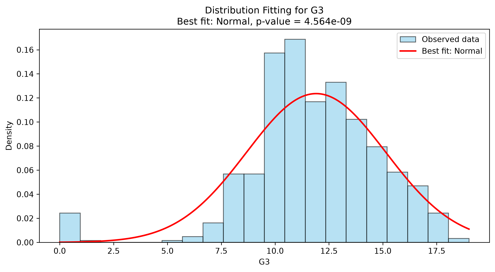
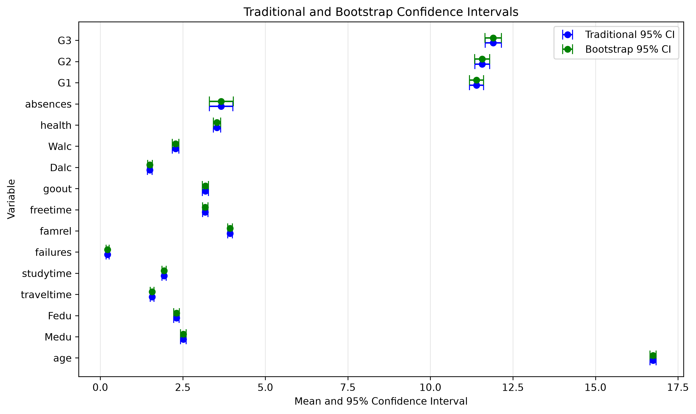

# Week 2 Report: Statistical Analysis

## Team: Statistics Superstars

**Date:** 10 September 2026

---

## 1. Hypothesis Testing Results

All tests used a significance level of 0.05.

### 1.1 T-Tests

| Test | Comparison | Statistic | P-value | Significant |
|---|---|---:|---:|:---:|
| One-sample t-test | Mean `G3` compared with 10 | 15.030 | 5.068 × 10⁻⁴⁴ | Yes |
| Welch independent t-test | Mean `G3` for female and male students | 3.275 | 0.0011 | Yes |

**Interpretation:**

- Mean `G3` was 11.906 and was significantly different from 10.
- Female students had a higher mean `G3` than male students (12.253 compared with 11.406). This is an association, not evidence of causation.

### 1.2 ANOVA

| Variable | Groups | F-statistic | P-value | Significant |
|---|---|---:|---:|:---:|
| `G3` | Four study-time groups | 15.876 | 5.706 × 10⁻¹⁰ | Yes |

Tukey HSD was used after the significant ANOVA result.

| Group 1 | Group 2 | Mean difference | Adjusted p-value | Significant |
|---:|---:|---:|---:|:---:|
| 1 | 2 | 1.2475 | 0.0001 | Yes |
| 1 | 3 | 2.3825 | <0.0001 | Yes |
| 1 | 4 | 2.2128 | 0.0007 | Yes |
| 2 | 3 | 1.1350 | 0.0103 | Yes |
| 2 | 4 | 0.9653 | 0.3084 | No |
| 3 | 4 | -0.1697 | 0.9927 | No |

**Interpretation:** Study-time groups 1–2, 1–3, 1–4, and 2–3 differed significantly. Groups 2–4 and 3–4 did not.

### 1.3 Chi-Square Test

| Variable 1 | Variable 2 | χ²-statistic | P-value | Significant |
|---|---|---:|---:|:---:|
| `sex` | `higher` | 1.827 | 0.1765 | No |

**Interpretation:** No significant association was found between sex and intention to pursue higher education.

---

## 2. Distribution Fitting

### 2.1 Best-Fitting Distributions

| Column | Best Fit | P-value | Good Fit? |
|---|---|---:|:---:|
| age | Normal | 8.029 × 10⁻¹⁸ | No |
| absences | Normal | 8.176 × 10⁻²⁷ | No |
| G1 | Lognormal | 4.932 × 10⁻⁴ | No |
| G2 | Gamma | 3.802 × 10⁻⁴ | No |
| G3 | Normal | 4.564 × 10⁻⁹ | No |

None of the tested distributions provided a good fit because every p-value was below 0.05.

### 2.2 Distribution Visualization

---

## 3. Confidence Intervals

### 3.1 Traditional Confidence Intervals (95%)

| Column | Mean | CI Lower | CI Upper | Width |
|---|---:|---:|---:|---:|
| age | 16.744 | 16.651 | 16.838 | 0.187 |
| absences | 3.659 | 3.302 | 4.017 | 0.714 |
| G1 | 11.399 | 11.188 | 11.610 | 0.422 |
| G2 | 11.570 | 11.346 | 11.794 | 0.448 |
| G3 | 11.906 | 11.657 | 12.155 | 0.497 |

### 3.2 Bootstrap Confidence Intervals (95%)

| Column | Mean | CI Lower | CI Upper | Width |
|---|---:|---:|---:|---:|
| age | 16.744 | 16.652 | 16.840 | 0.188 |
| absences | 3.659 | 3.307 | 4.032 | 0.726 |
| G1 | 11.399 | 11.186 | 11.609 | 0.422 |
| G2 | 11.570 | 11.339 | 11.797 | 0.458 |
| G3 | 11.906 | 11.652 | 12.151 | 0.499 |

**Comparison:** The two methods produced very similar intervals. Bootstrap intervals are useful here because the selected variables were not normally distributed.

---

## 4. Key Statistical Findings

1. All five selected variables failed the Week 1 normality tests.
2. Mean final grades differed by sex and by study-time group in this sample.
3. None of the five tested continuous distributions fitted the selected variables well.
4. Traditional and bootstrap confidence intervals were very similar.

---

## 5. Interpretation & Conclusions

### 5.1 What the Results Mean

- Study time and previous grades are useful areas for further analysis.
- The tests show differences and associations in this dataset, not causes.
- The confidence intervals give a reasonable range for each population mean.

### 5.2 Limitations

- The data are observational and come from only two schools.
- The selected variables are discrete and non-normal.
- Other variables may explain some of the observed group differences.

### 5.3 Recommendations for Week 3

- Highlight the study-time results in the dashboard.
- Show sample sizes and confidence intervals with group means.
- Keep a short note that association does not prove causation.

---

## 6. Team Contributions

| Team Member | Student ID | Tasks Completed | Hours |
|---|---:|---|---:|
| Khant Min Zaw | 6845028 | Repository updates, report structure, and code review | 2 |
| Hsu Mon San | 6845030 | Statistical functions, tests, distribution fitting, confidence intervals, bootstrap analysis, and documentation | 8 |
| Min Khant Kyaw | 6845034 | Statistical visualization and dashboard support | 3 |

---

## Appendix

**Files Generated:**

- `reports/hypothesis_tests_summary.csv`
- `reports/anova_tukey_hsd.csv`
- `reports/distribution_fitting_summary.csv`
- `reports/ci_comparison.csv`
- `reports/figures/distribution_fit_*.png`
- `reports/figures/confidence_intervals_comparison.png`
- `src/statistics.py`
- `tests/test_statistics.py`

**Notebooks:**

- `notebooks/02_hypothesis_testing.ipynb`
- `notebooks/03_distribution_fitting.ipynb`
- `notebooks/04_confidence_intervals.ipynb`
